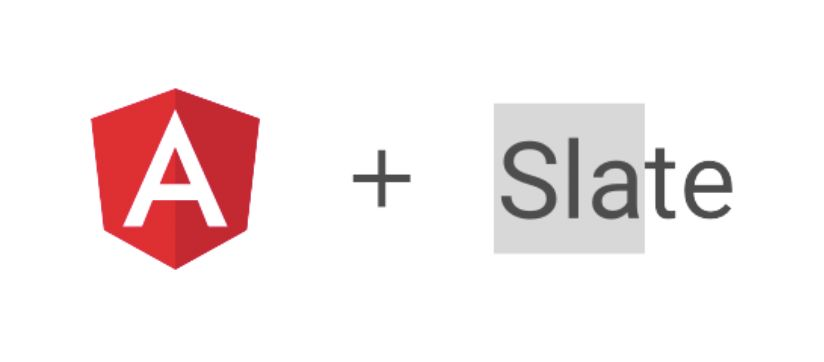

  

  An angular view layer base on Slate  
  for building rich text editors.

 

 

### Introduction
Slate is a completely customizable framework for building rich text editors. In principle, Slate is frame-independent. It's core layer implementation does not depend on any front-end framework. The framework-related parts are extracted into an independent view layer, but currently the official only provides a React-based view layer, in order to be able to Using Slate in the Angular framework, we have developed a view layer based on Angular, so that you can easily develop a rich text editor based on Angular + Slate.

In the process of developing slate-angular, we made a lot of reference to the implementation of slate-react, and kept closely updated with the official implementation of slate-react, and we fixed a large number of Chinese input crashes, so you can trust it enough , Start your slate-angular journey.

### Development scripts

Useful scripts include:

`npm install` Installs package dependencies

`​npm run start` Start Demo

`npm run build` build slate-angular library

#### Prerequisites
Angular >= 10.x
Slate >= 0.58.4

#### Contributing
🌟 Stars and 📥 Pull requests to worktile/slate-angular are welcome! Don't hesitate to share your plugins here. 